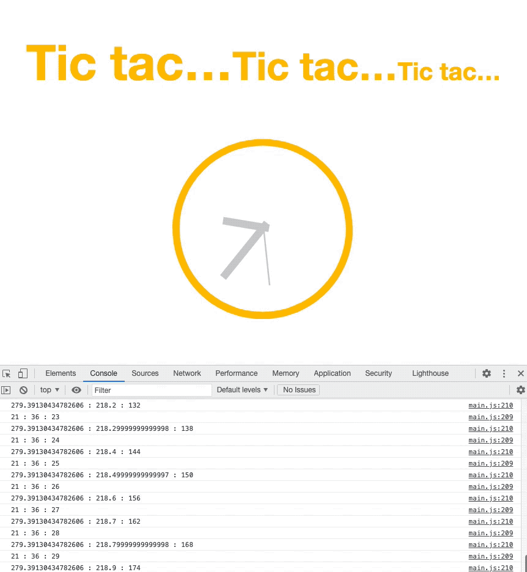

# SVG Clock

> A JS exercise use at HEPL for DCC.

* * *

**js-tp-password** is an educational project, which will be used for `JS` courses.

**Note:** the school where the course is given, the [HEPL](http://www.provincedeliege.be/hauteecole) from Liège, Belgium, is a French-speaking school. From this point, the instruction will be in French. Sorry.

* * *


## SVG

L'SVG (Scalable Vector Graphics) est un format de données, fondé sur l'XML qui permet la description des images vectorielles. Ce format est maintenant nativement supporté par la plupart des navigateurs modernes. On peut s'en servir comme source d’une image. On peut aussi s'en servir en CSS avec, par exemple, la propriété `background-image`. Pourtant, ces 2 manières ne permettent pas d'interagir dynamiquement avec le contenu graphique (or c’est souvent ce que nous recherchons). Concrètement, on ne peut donc pas, par JavaScript ou CSS, changer des propriétés de l'image. Pour remédier à cette limitation, on peut soit charger le fichier SVG avec la balise `<objec>`. Mais on peut aussi inclure l'SVG directement dans le document HTML, ainsi il devient un noeud du DOM et devient manipulable par JavaScript au même titre que les autres balises. Dans le cadre de cet exercice, nous allons donc charger l’SVG directement dans le document.

Nous vous encourageons, très fortement, de vous intéresser à ce format qui offre des nombreux avantages. Vous pouvez commencer par la lecture de l'article [Using SVG](https://css-tricks.com/using-svg/) de Chris Coyier sur [css-tricks](https://css-tricks.com) ou encore l'article [SVG ou Canvas, que choisir ?](https://openweb.eu.org/articles/canvas_svg_que_choisir) de Jeremie Patonnier sur [openweb](https://openweb.eu.org) et bien sûr la [documentation officielle](https://www.w3.org/TR/SVG/) qui d’ailleurs a été [traduite](http://www.yoyodesign.org/doc/w3c/svg1/).


## Énoncé

Mais revenons à notre exercice. Nous vous demandons ici d'animer une horloge SVG à l'aide de JavaScript. 

Pour cela vous devez : 

1. Récupérer l'heure du navigateur. Je vous invite à utiliser la classe [Date](https://developer.mozilla.org/fr/docs/Web/JavaScript/Reference/Global_Objects/Date).
2. Une fois que vous disposez d’une instance `Date`, vous pouvez appeler ses méthodes. Par exemple : récupérer les secondes avec la méthode `getSeconds`. 
3. Dès lors que vous êtes capable de récupérer les trois paramètres, dont vous avez besoin, heures, minutes et secondes, convertissez-les en degrés. Cela vous permettra d'application la rotation nécessaire aux aiguilles de l'horloge. 
4. Maintenant, il ne vous reste plus qu'à faire tourner les aiguilles du cadran au rythme, si régulier, des secondes. Par exemple pour les minutes, il vous suffit de récupérer l'aiguille des minutes `<rect id="minutes" .../>` et de lui appliquer sa rotation. Vous pouvez utiliser la propriété `transform`, déjà présente dans la balise. [Ici](https://developer.mozilla.org/fr/docs/Web/SVG/Attribute/transform#rotate) le lien vers la documentation. 





## Aides

1. Récupérer la date avec [Date](https://developer.mozilla.org/fr/docs/Web/JavaScript/Reference/Global_Objects/Date)
1. Récupérer les [minutes](https://developer.mozilla.org/fr/docs/Web/JavaScript/Reference/Global_Objects/Date/getMinutes)
1. L'attribut [transform](https://developer.mozilla.org/fr/docs/Web/SVG/Attribute/transform#rotate) en SVG. 


## Quelques idées 

* Un cercle est divisé en 360 degrés;
* Toute fraction de temps peut être convertie vers une fraction de cercle.
* Si 60 secondes, dans une minute, remplissent 360 degrés dans un cercle alors par une règle de trois, on retrouve la proportion qu'entretiennent les secondes avec les degrés. Voici un exemple où je calcule la rotation nécessaire de la trotteuse, pour 18 secondes. 

```
60 secondes = 360°
  1 seconde = 6°
18 secondes = 108°
```


* Poursuivons avec les minutes. Par exemple, 18 minutes représentent un peu plus d'un quart d'heure. Très exactement 18 minutes des 60 disponibles dans une heure. Si nous voulons connaître la proportion exacte, il nous suffit donc de diviser 18 minutes pars les 60 disponibles `(18/60)`. Il ne reste plus qu'à appliquer ce rapport aux degrés du cercle. Soit `(18/60)*360`
* Pour les heures, c'est le même principe, je vous laisse trouver. Notez, tout de même, qu'il y a bien 24 heures dans une journée, or, vous, dans le cadre de votre horloge, vous traitez indifféremment l’affichage, qu'il soit 3 heures ou 15 heures. Dans les deux cas, vous devez donc placer l’aiguille à la même position.

## Sources 

* css-tricks : [Using SVG](https://css-tricks.com/using-svg/)

